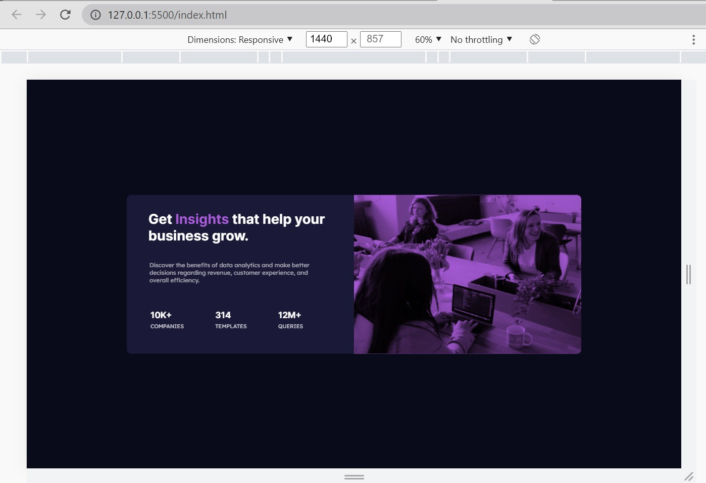
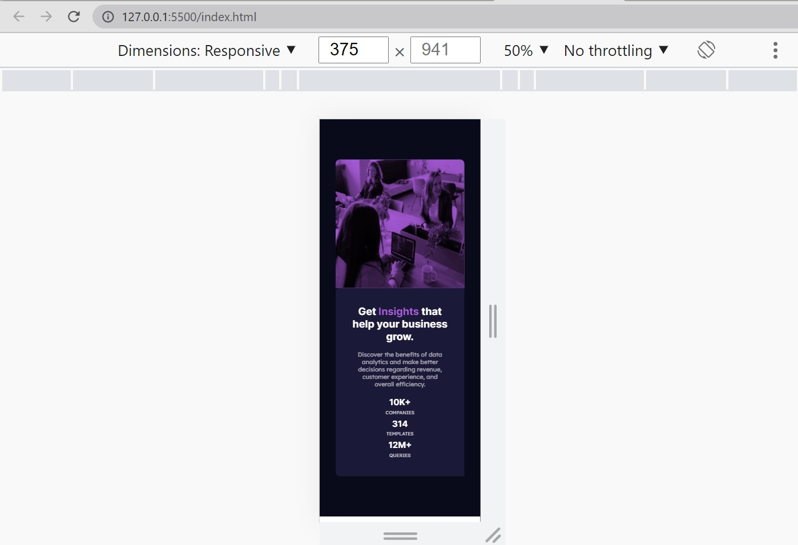

# frontendmentorChallenge3
Frontend Mentor | Stats preview card component

## Table of contents

- [Overview](#overview)
  - [The challenge](#the-challenge)
  - [Screenshot](#screenshot)
  - [Links](#links)
- [My process](#my-process)
 <!-- - [Built with](#built-with)
  - [What I learned](#what-i-learned)
  - [Continued development](#continued-development)
  - [Useful resources](#useful-resources)-->
- [Author](#author)
<!-- - [Acknowledgments](#acknowledgments)-->

## Overview

### The challenge

Your challenge is to build out this card component and get it looking as close to the design as possible.

You can use any tools you like to help you complete the challenge. So if you've got something you'd like to practice, feel free to give it a go.

Your users should be able to:

- View the optimal layout depending on their device's screen size

### Screenshot

### Links

- Solution URL: [Add solution URL here](https://github.com/krtksharma/FrontEndMentorChallenge3)
- Live Site URL: [Add live site URL here](https://krtksharma.github.io/FrontEndMentorChallenge3/)

## My process

### Built with

- Semantic HTML5 markup
- CSS custom properties
- Flexbox
- mediaquery

## Author

- Frontend Mentor - [@krtksharma](https://www.frontendmentor.io/profile/krtksharma)
